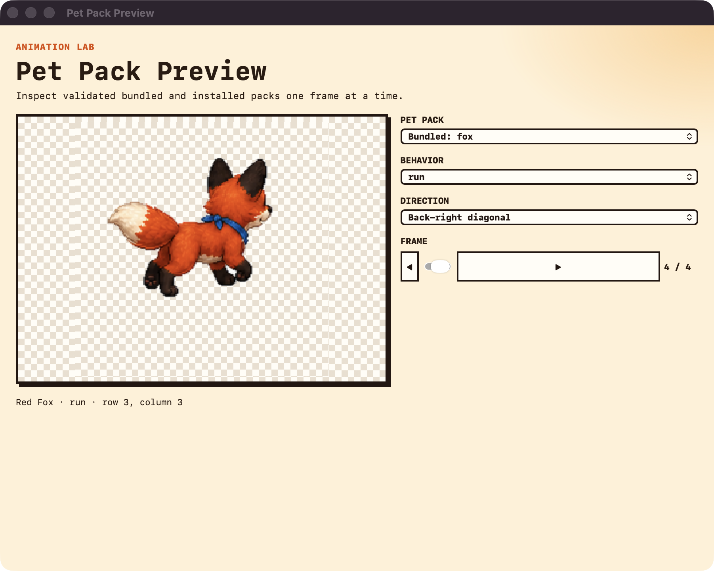
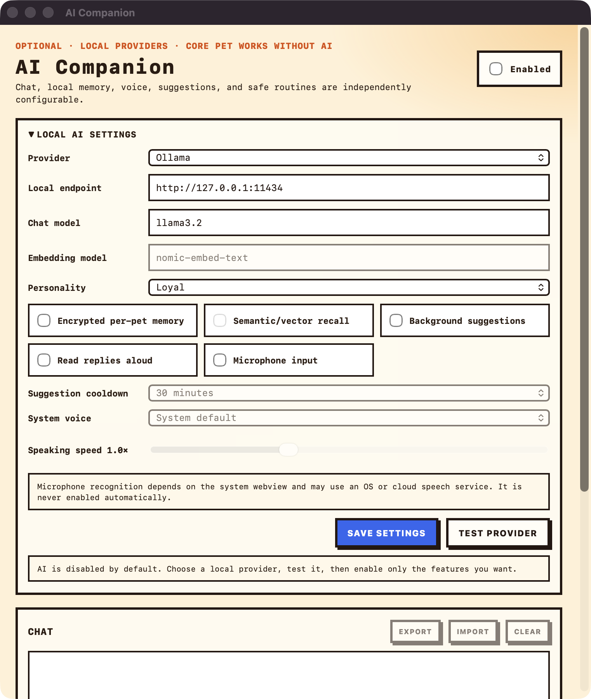

# Virtual Pet Desktop

[](https://github.com/sheelarajeshkumar/virtual-pet-desktop/actions/workflows/ci.yml)
[](LICENSE)
[](#platform-support)

An open-source, cross-platform animated desktop pet built with Tauri. Add pets, behaviors, animations, sounds, and community features for macOS and Windows.

## Features

- Transparent, click-through 128×128 desktop overlay
- Smooth walk, run, idle, bark, play, sleep, attention, and sniff animations
- Side, front, back, and diagonal movement with optional directional atlases
- Cursor following with acceleration and deceleration
- macOS fullscreen Spaces and mixed-DPI monitor support
- Native tray controls for Auto, Call over, Play, Bark, Sleep, and Settings
- One-shot bark action with a real CC0 dog recording
- Manifest-driven puppy, fluffy-cat, and red-fox pet packs with an animation preview tool
- Persistent hunger, energy, happiness, and cleanliness with care actions
- Persistent food/toy inventory with safe restocking
- Optional day/night sleep routine and opt-in care notifications
- Validated install/remove flow for community pet-pack folders
- Portable settings/care backups and safe community-pack export
- Bounded JSON behavior extensions that cannot execute code
- Global hide/show shortcut, configurable from Settings
- Optional local Ollama, LM Studio, or llama.cpp companion with streaming chat, encrypted per-pet memory, semantic recall, personalities, proactive suggestions, voice controls, and confirmed actions/routines
- Configurable pet size, movement speed, sound volume, reduced motion, and care difficulty
- Persistent pet name, species, appearance, and care settings
- Lightweight JavaScript canvas renderer with a Rust movement engine

## Project status

Virtual Pet Desktop is an early community release. The offline pet core works independently from the optional local AI companion. Signed public release automation is prepared, while Windows GUI verification and signing still require maintainer hardware and credentials.

## Requirements

- [Node.js](https://nodejs.org/) 20 or newer
- [Rust](https://www.rust-lang.org/tools/install) 1.85 or newer
- Tauri's [platform prerequisites](https://v2.tauri.app/start/prerequisites/)

## Run locally

```bash
git clone git@github.com:sheelarajeshkumar/virtual-pet-desktop.git
cd virtual-pet-desktop
npm install
npm run dev
```

Use the paw icon in the system tray or macOS menu bar to control the pet.

## Controls

| Action | Behavior |
| --- | --- |
| Auto | Follows recent cursor movement, wanders, and eventually sleeps |
| Call over | Continuously follows the cursor |
| Play | Plays around the cursor |
| Bark | Barks once, then returns to Auto |
| Sleep | Walks home and sleeps |
| Care | Feed, pet, play with, wash, rest, or restock the pet |
| Pet packs | Installs or removes validated community pack folders |
| Preview pet packs | Inspects exact side/front/back/diagonal atlas frames |
| Behaviors | Imports and runs bounded declarative action routines |
| Backup and export | Backs up local state or exports an installed community pack |
| AI companion | Configures optional local-provider chat, memory, voice, and confirmed pet actions/routines |
| Name and pet | Updates appearance, motion, audio, and care settings |
| Hide/show pet | Toggles the overlay; default shortcut is `CommandOrControl+Shift+P` |

## Checks

```bash
npm ci
npm run check
npm test
```

## Build installers

Build macOS artifacts on macOS and Windows artifacts on Windows:

```bash
npm run build
```

Unsigned development builds are created under `src-tauri/target/release/bundle`. Public releases must be Apple-signed/notarized and Windows code-signed.

## Platform support

| Platform | Status |
| --- | --- |
| macOS 10.15+ | Actively developed and tested |
| Windows 10/11 | Supported; the automated package build is ready, manual GUI verification remains required |
| Linux | Compile investigation only; not a supported release target yet |

## Contributing

Contributions of code, pixel art, animations, sounds, documentation, testing, and ideas are welcome. Start with [CONTRIBUTING.md](CONTRIBUTING.md), then read the relevant guide:

- [Architecture](docs/ARCHITECTURE.md)
- [Adding a pet](docs/ADDING_PETS.md)
- [Animation and asset guide](docs/ANIMATION_GUIDE.md)
- [Behavior extensions](docs/BEHAVIOR_EXTENSIONS.md)
- [Optional AI companion](docs/AI_COMPANION.md)
- [Release media workflow](docs/MEDIA.md)
- [Windows test checklist](docs/WINDOWS_TESTING.md)
- [Linux status](docs/LINUX_STATUS.md)
- [Roadmap](ROADMAP.md)

Please report security issues privately according to [SECURITY.md](SECURITY.md).

## Release preview





[Watch the 15-second fox animation demo](docs/media/demo.mp4).

[Watch the 30-second LinkedIn project demo](docs/media/linkedin-demo.mp4).

## Asset credits

The puppy and fox sprite sheets are original project assets; fox art, including the directional atlas, was created with OpenAI image generation and cleaned for production transparency. Bark audio is adapted from [Small Dog Barking Behind Door](https://bigsoundbank.com/small-dog-barking-behind-door-s3537.html) by Joseph SARDIN and Axeline T., released under CC0. See [ASSETS.md](ASSETS.md) and the per-pack asset records for details.

## License

Source code and original project assets are available under the [MIT License](LICENSE). Third-party assets retain the licenses listed in [ASSETS.md](ASSETS.md).
